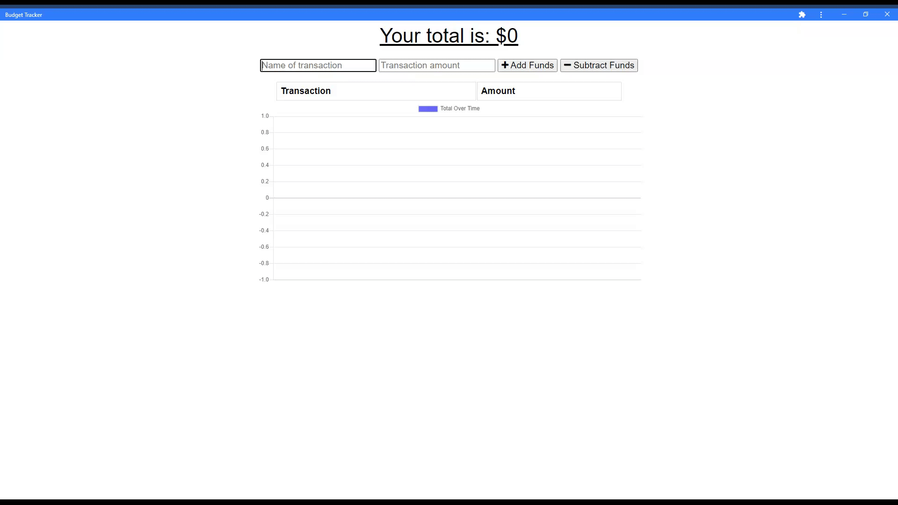

# budget-tracker
A PWA for online or offline tracking of deposits and withdrawals 

## Description
This application is a simple budget tracking tool that allows for entry of both deposits and expenses, and follows the progressive web application architecture.   The front end was created using JavaScript, CSS, Chart.js, and Font-Awesome.   The backend is supported by Node, Express, Mongoose, and MongoDb.  The application uses the Cache Storage API, Fetch API and IndexDB to facilitate offline-access and data persistence. 

### Functionality
* Create new deposits
* Create new withdrawals
* View transaction history
* View total balance
* View line graph of total balance over time
* Offline-support
* Installation via Chrome web browser or mobile device


### NPM Dependencies
* express
* lite-server
* mongoose
* morgan
* compression

[Link to the repository](https://github.com/pkriengsiri/budget-tracker)
  
## Table of Contents
* [Installation](#installation)
* [Usage](#usage)
* [Credits](#credits)
* [License](#license)
* [Contributing](#contributing)
* [Questions](#questions)
  
## Installation
From GitHub, fork the repo and upload all contents to the deployed server.  The server must have Node.js installed. Once forked, run 'npm i' from the root directory to install required dependencies.  

Modify the `server.js` connection to match your MongoDB server configuration.

## Usage

Run `npm start` to start the application.

Link to the deployed example: 





## Credits
This application was created during class activities under the guidance and direction of Boot Camp instructor, [Jonathan Watson](https://github.com/jonathanjwatson).


## License
This application is covered under MIT License

<details>
  <summary>
    License Text
  </summary> 

```

Copyright (c) 2021  Pete Kriengsiri

Permission is hereby granted, free of charge, to any person obtaining a copy
of this software and associated documentation files (the "Software"), to deal
in the Software without restriction, including without limitation the rights
to use, copy, modify, merge, publish, distribute, sublicense, and/or sell
copies of the Software, and to permit persons to whom the Software is
furnished to do so, subject to the following conditions:
      
The above copyright notice and this permission notice shall be included in all
copies or substantial portions of the Software.
      
THE SOFTWARE IS PROVIDED "AS IS", WITHOUT WARRANTY OF ANY KIND, EXPRESS OR
IMPLIED, INCLUDING BUT NOT LIMITED TO THE WARRANTIES OF MERCHANTABILITY,
FITNESS FOR A PARTICULAR PURPOSE AND NONINFRINGEMENT. IN NO EVENT SHALL THE
AUTHORS OR COPYRIGHT HOLDERS BE LIABLE FOR ANY CLAIM, DAMAGES OR OTHER
LIABILITY, WHETHER IN AN ACTION OF CONTRACT, TORT OR OTHERWISE, ARISING FROM,
OUT OF OR IN CONNECTION WITH THE SOFTWARE OR THE USE OR OTHER DEALINGS IN THE
SOFTWARE.

```
</details>


## Contributing
No contributions are being accepted at this time.
  
## Badges


## Questions
Contact me via [email](mailto:pkriengsiri@gmail.com).
View my GitHub [profile](https://github.com/pkriengsiri).